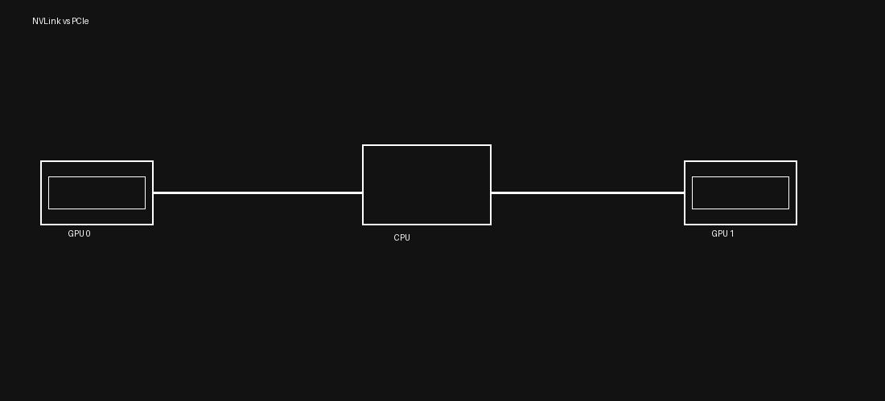
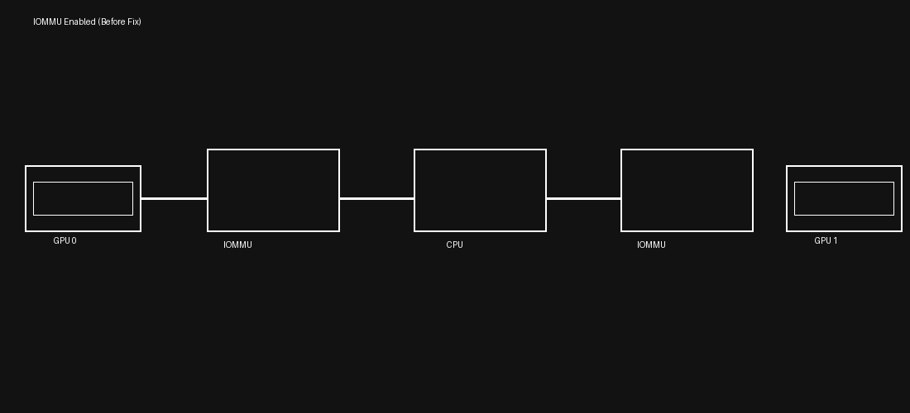
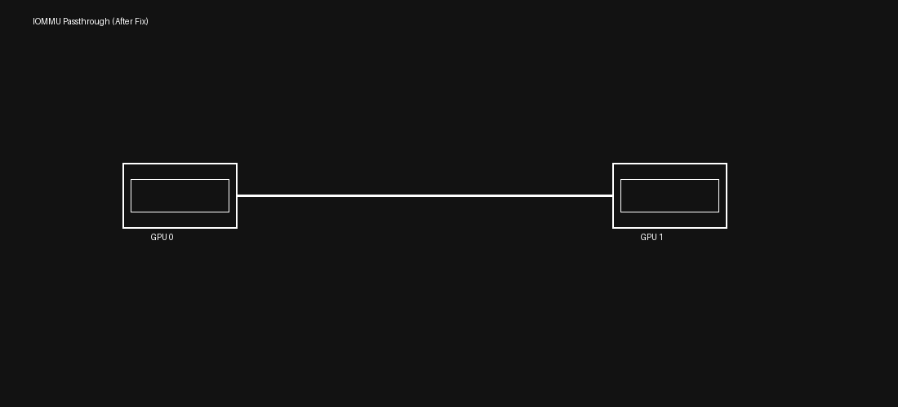

# 🚀 Fixing NCCL Hangs on NVIDIA L40S GPUs

> A deep dive into diagnosing and resolving NCCL deadlocks caused by IOMMU interference in PCIe-based GPU systems.
> ⚠️ Affects PCIe-based GPUs (e.g., L40S) — does NOT typically occur on NVLink systems (A100/H100)


---

## ⚡ Key Results

- ✅ Eliminated NCCL hangs under heavy load  
- ✅ Restored stable distributed training workloads  
- ✅ Achieved consistent ~13 GB/s bandwidth  
- ✅ No application/code changes required  

---

## 🧩 Problem

Distributed training workloads using **NCCL** may hang on **NVIDIA L40S GPUs** due to:

- PCIe-only GPU communication (no NVLink)
- IOMMU intercepting peer-to-peer (P2P) traffic
- Increased latency and contention under load

This results in:
- ❌ Hanging `all_reduce` operations  
- ❌ Stalled training jobs  
- ❌ Unstable multi-GPU performance  

---

## 🧠 Root Cause

Unlike A100/H100 GPUs, L40S relies entirely on **PCIe**.

With default system configuration:
GPU → IOMMU → CPU → IOMMU → GPU

IOMMU introduces:
- Address translation overhead  
- PCIe traffic interception  
- Potential deadlocks under high throughput  

---

## 📊 Architecture

### NVLink vs PCIe



---

### 🔴 Before Fix (IOMMU Enabled)



---

### 🟢 After Fix (Passthrough Enabled)



---

## 🛠️ Solution

Enable IOMMU passthrough:

```bash
sudo grubby --update-kernel=ALL --args="amd_iommu=on iommu=pt"
sudo reboot
```
## ⚠️ Reboot Required